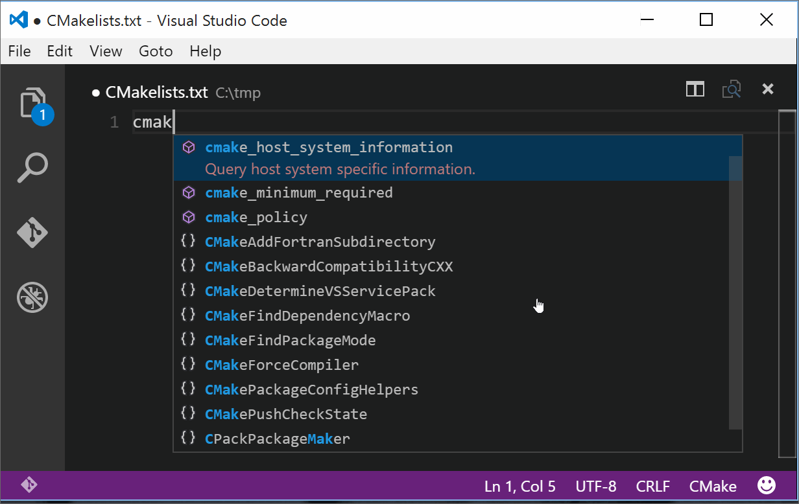
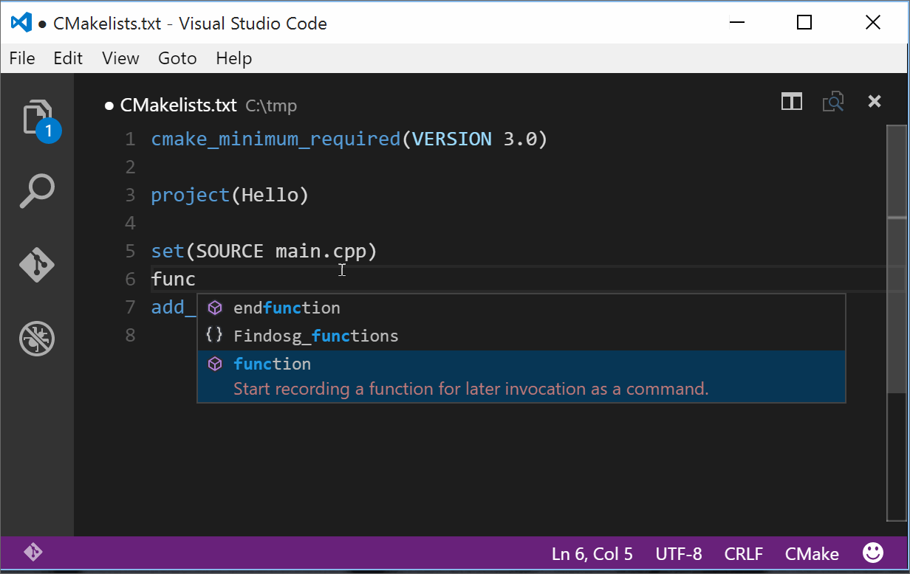
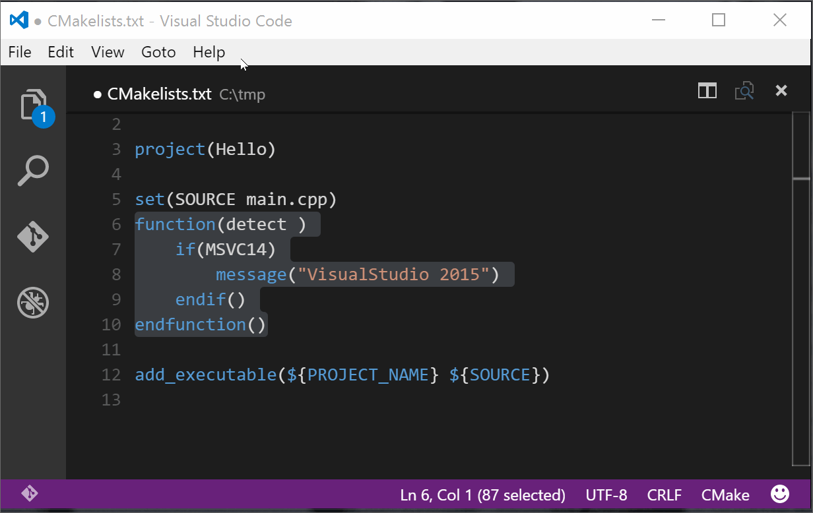
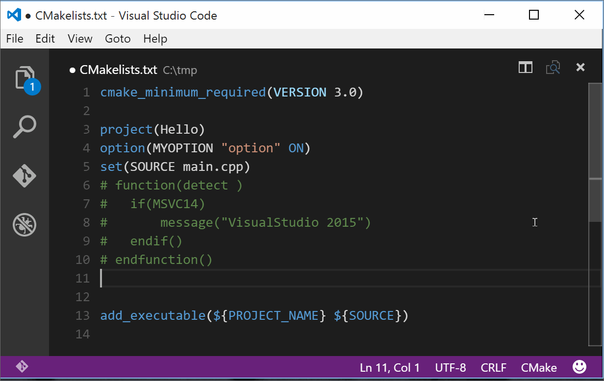
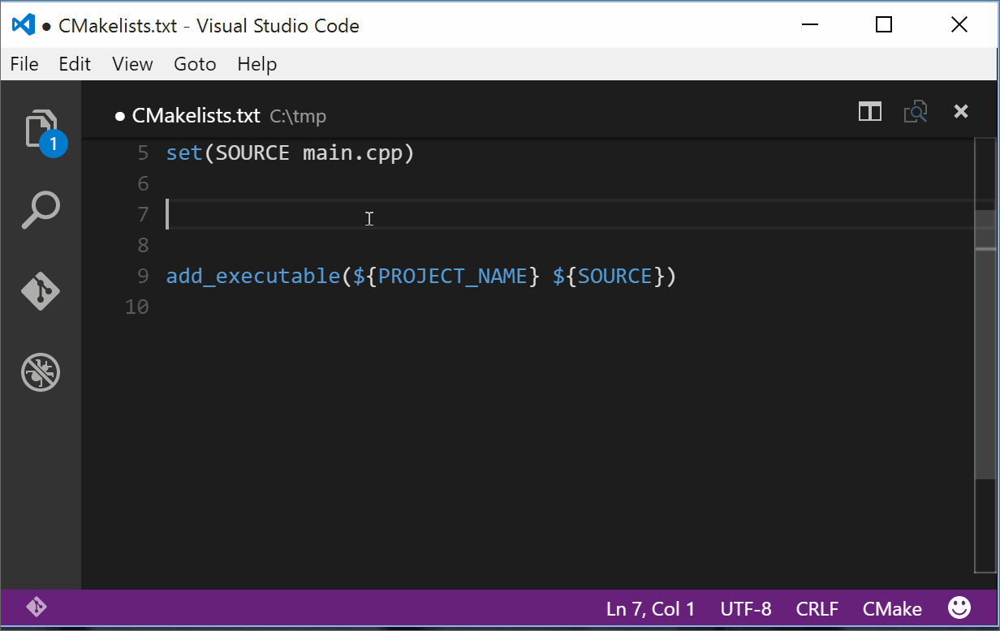

# CMake For VisualStudio Code

[](https://gitter.im/twxs/vs.language.cmake?utm_source=badge&utm_medium=badge&utm_campaign=pr-badge&utm_content=badge)

This extension provides support for [CMake](http://www.cmake.org/) in [Visual Studio Code](https://code.visualstudio.com/).



## Features

- Colorization
- Completion Lists



- Code comments



- Snippets





- Quick Help


- Access To Online Help

## Options

The following Visual Studio Code settings are available for the Cmake extension. These can be set in user preferences (cmd+,) or workspace settings (.vscode/settings.json).

```json
{
    "cmake.cmakePath": "/path/to/cmake"
}
```

## Commands

- `CMake: Online Help` to go to the CMake online documentation (according to the current cmake version).

## Acknowledgements

This extension based on the TextMate Syntax from [this project](https://github.com/zyxar/Sublime-CMakeLists).

## Contributors

- [Stanislav Ionascu](https://github.com/stanionascu)
- [Rostislav Kondratenko](https://github.com/rkondratenko)

Feel free to contribute...

## License

[MIT](LICENSE)
